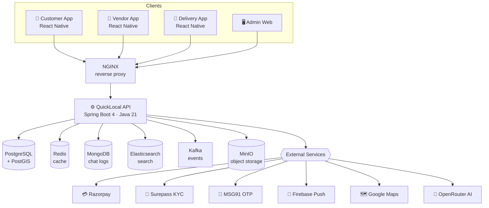

<div align="center">

# 🛒 QuickLocal — Hyperlocal Delivery Platform (Backend)

### A production-grade, Blinkit/Zepto-style quick-commerce backend for India — built with Spring Boot 4 & Java 21.

[](https://github.com/Divyansh-Official/QUICKLOCAL-BACKEND-SPRINGBOOT/actions/workflows/ci.yml)
[](https://github.com/Divyansh-Official/QUICKLOCAL-BACKEND-SPRINGBOOT/actions/workflows/codeql.yml)
[](https://github.com/Divyansh-Official/QUICKLOCAL-BACKEND-SPRINGBOOT/actions/workflows/security.yml)


</div>

---

## 📖 Overview

**QuickLocal** is the backend that powers a hyperlocal, on-demand delivery marketplace — connecting
**customers**, **vendors (stores)**, and **delivery partners** in real time. It handles everything from
OTP login and vendor KYC, through geo-aware catalog search and cart checkout, to Razorpay payments,
automatic delivery assignment, and admin analytics.

It is **API-only and transport-agnostic** — the same backend serves the **React Native** apps
(customer / vendor / delivery) and the **admin web dashboard** with no changes.

> **17 modules · 344 source files · 750+ automated tests · 32 database migrations · full CI/CD + security scanning.**

---

## 🏗️ Architecture



---

## 🧰 Tech Stack

| Layer | Technology |
|---|---|
| **Language / Runtime** | Java 21, Spring Boot 4, Spring Framework 7 |
| **Security** | Spring Security 7, JWT (jjwt), AES-256-GCM encryption, Bucket4j rate limiting |
| **Persistence** | PostgreSQL + **PostGIS** (geo), Spring Data JPA, **Flyway** (V1→V32) |
| **Caching / Events** | Redis, **Apache Kafka** (transactional outbox), MongoDB (chat) |
| **Search** | Elasticsearch (fuzzy) + PostGIS (nearby vendors) |
| **Storage** | MinIO (S3-compatible), magic-byte upload validation |
| **Resilience** | Resilience4j (circuit breakers), ShedLock (distributed scheduling) |
| **Integrations** | Razorpay, Surepass KYC, MSG91, Firebase, Google Maps, **OpenRouter (AI helpdesk)** |
| **Mapping / Boilerplate** | MapStruct, Lombok |
| **Observability** | Actuator, Micrometer/Prometheus, correlation-id (MDC) logging |
| **DevOps** | Docker (multi-stage), Docker Compose, NGINX, GitHub Actions CI/CD |

---

## 📦 Modules & Features

| Module | What it does |
|---|---|
| 🔐 **auth** | OTP + password login, JWT + refresh tokens, 5 roles, account lockout, device fingerprinting |
| 👤 **user** | Customer / vendor / delivery profiles, addresses, document uploads, **referrals** |
| 🪪 **verification** | KYC via Surepass (Aadhaar / PAN / Bank), full vendor KYC workflow |
| 🏪 **vendor** | Onboarding, payout linked-accounts, analytics dashboard, order views |
| 🛍️ **product** | Catalog, categories, offers, race-safe stock management |
| 🔎 **search** | Fuzzy + **geo** product search, autocomplete, trending, nearby vendors |
| 🏠 **home** | Personalized location-aware home feed, recently-viewed, catalog versioning |
| 📦 **order** | Cart → order placement (**idempotent**), vendor accept/reject, **OTP-verified delivery** |
| 💳 **payment** | Razorpay orders + capture, **HMAC-verified webhooks**, refunds, split payouts |
| 🛵 **delivery** | Auto delivery-partner assignment, live location tracking, status + OTP |
| 🔔 **notification** | Firebase push + in-app notifications |
| ⭐ **review** | Product & vendor reviews |
| ⚖️ **complaint** | Complaints, sub-admin dispute resolution, strikes & bans |
| 💎 **subscription** | Vendor subscription plans & visibility boosts |
| 🛠️ **admin** | Runtime config, **feature flags**, manual payouts, sub-admins, analytics + **Excel export** |
| 🤖 **helpdesk** | **AI support chat via OpenRouter** (free models), MongoDB conversation logs |
| 📣 **ads** | AdMob configuration, feature-flag–gated |

---

## 🛡️ Engineering Highlights

This isn't a CRUD demo — it's built for correctness and money-safety under concurrency:

- **🧾 Transactional Outbox** — events are persisted in the same DB transaction as the business write and relayed to Kafka, so an order/payment event is **never lost and never duplicated**.
- **🔒 Concurrency-safe money** — pessimistic locks on payment capture (no double-charge), locked referral claims (no double-reward), atomic conditional stock decrement (no overselling).
- **🪪 Idempotency** — duplicate order/payment requests are de-duplicated by key.
- **🚫 IDOR protection** — every `/{id}` fetch is **ownership-scoped** (`findByIdAndCustomerId` / `findByIdAndVendorId`) so users can never read each other's data.
- **🔐 Secrets & crypto** — AES-256-GCM field encryption; a **fail-fast prod validator** refuses to boot with weak/placeholder secrets.
- **🛰️ Resilience** — Resilience4j circuit breakers + bounded HTTP timeouts on every external call; graceful degradation when a dependency is down.
- **🌐 Hardened transport** — stateless JWT, env-driven CORS, proxy-aware rate limiting, correlation-id tracing.

---

## ✅ Quality & CI/CD

Every push runs a full pipeline — all green:

| Check | Tooling |
|---|---|
| **Build & Unit Tests** | Maven + JUnit 5 / Mockito / AssertJ — **750+ tests**, JaCoCo coverage gate |
| **Integration Tests** | **Testcontainers** against a real **PostGIS** container (Flyway V1→V32 + schema validation) |
| **SAST** | **CodeQL** (security-extended) |
| **Dependency & Image CVEs** | **Trivy** (filesystem + container) |
| **Secret Scanning** | **Gitleaks** |
| **Container Build** | Multi-stage **Docker** image |

---

## 🚀 Getting Started

### Option 1 — GitHub Codespaces (one click, nothing to install)

1. Click **`< > Code` ▸ `Codespaces` ▸ `Create codespace on main`**.
2. In the terminal:
   ```bash
   docker compose up -d          # boots Postgres, Redis, Kafka, Mongo, ES, MinIO + the API
   docker compose logs -f app    # wait for "Started QuicklocalBackendApplication"
   ```
3. Open the forwarded **port 8081** → that's your live API.

> See [`.devcontainer/README.md`](.devcontainer/README.md) for details.

### Option 2 — Local (Docker)

```bash
git clone https://github.com/Divyansh-Official/QUICKLOCAL-BACKEND-SPRINGBOOT.git
cd QUICKLOCAL-BACKEND-SPRINGBOOT
cp .env.example .env             # fill in real values for a real deployment
docker compose up -d
```

### Option 3 — Run the app natively

```bash
./mvnw spring-boot:run           # requires the backing services running (compose up the infra)
./mvnw clean test                # run the full test suite
```

### Configuration

All secrets/config come from environment variables (see [`.env.example`](.env.example)) —
`JWT_SECRET`, `ENCRYPTION_KEY`, Razorpay / Surepass / MSG91 / Firebase / Google Maps keys,
`OPENROUTER_API_KEY`, and the datasource URLs. Under the `prod` profile the app **refuses to start**
with placeholder secrets — by design.

---

## 🗂️ Project Structure

```
src/main/java/com/quicklocal/quicklocal_backend/
├── core/            # cross-cutting: config, security, exceptions, response envelope,
│                    #   outbox, encryption, observability, utilities
└── modules/         # one package per bounded context (controller·service·repository·model·dto·mapper·event)
    ├── auth/  user/  vendor/  verification/  product/  search/  home/
    ├── order/ payment/ delivery/ notification/ review/ complaint/
    └── subscription/ admin/ helpdesk/ ads/
src/main/resources/db/migration/   # Flyway migrations V1 → V32
```

---

## 📈 Status & Roadmap

**Current: `v0.9.0-beta`** — feature-complete, CI-green, ready for staging/beta testing.

- ✅ All 17 modules implemented & tested
- ✅ Full CI/CD + security scanning (CodeQL · Trivy · Gitleaks)
- ✅ Dockerized, Compose stack, Codespaces dev environment
- 🔜 Load/performance testing (k6) before a `v1.0.0` production launch
- 🔜 Externalize payment-gateway calls from DB transactions
- 🔜 Dependency CVE upgrades, Grafana/ELK dashboards

---

## 👤 Author

**Divyansh Tiwari** — design, architecture & implementation.

## 📄 License

© 2026 Divyansh Tiwari. All rights reserved. _(No open-source license granted; for evaluation/reference.)_

---

<div align="center">
<sub>Built with Spring Boot 4 · Java 21 · ❤️ for hyperlocal commerce.</sub>
</div>
