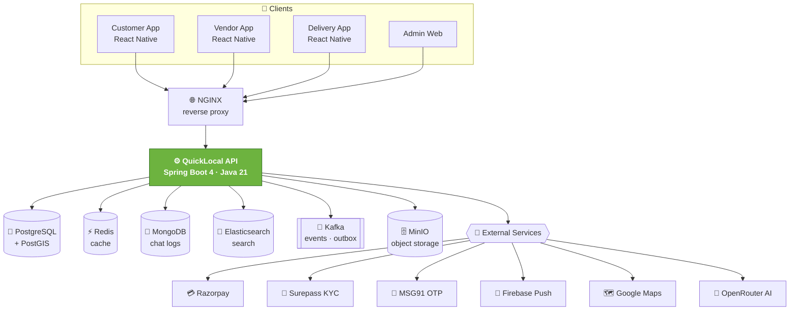
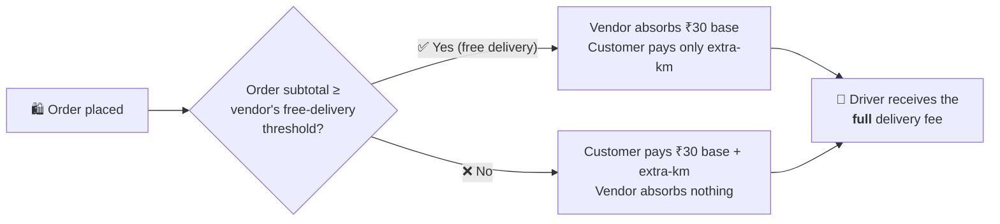

<div align="center">

<!-- ░░░░░░░░░░░░░░░░░░░░░░░░░░░░░░░░░░░░░░░░░░░░░░░░░░░░░░░░░░░░░░░░░ -->

# 🛒 QuickLocal — Hyperlocal Delivery Platform

### **A production-grade, Blinkit / Zepto–style quick-commerce backend for India.**
#### Spring Boot 4 · Java 21 · event-driven · money-safe under concurrency.

<br/>

<!-- ── CI / Security ── -->
[](https://github.com/Divyansh-Official/QUICKLOCAL-BACKEND-SPRINGBOOT/actions/workflows/ci.yml)
[](https://github.com/Divyansh-Official/QUICKLOCAL-BACKEND-SPRINGBOOT/actions/workflows/codeql.yml)
[](https://github.com/Divyansh-Official/QUICKLOCAL-BACKEND-SPRINGBOOT/actions/workflows/security.yml)

<!-- ── Stack ── -->


<!-- ── Stats ── -->


</div>

<div align="center">

```
┌──────────────┬───────────────┬───────────────┬──────────────┬───────────────┐
│  17 modules  │  353 sources  │  773 tests ✅  │ 37 migrations │  CI · all 🟢   │
└──────────────┴───────────────┴───────────────┴──────────────┴───────────────┘
```

</div>

---

## 📖 Overview

**QuickLocal** is the backend powering a hyperlocal, on-demand delivery marketplace — connecting
**customers**, **vendors (stores)**, and **delivery partners** in real time. It handles everything from
OTP login and vendor KYC, through geo-aware catalog search and cart checkout, to Razorpay payments,
automatic delivery assignment, a transparent **money-split engine**, and admin analytics.

It is **API-only and transport-agnostic** — the same backend serves the **React Native** apps
(customer / vendor / delivery) and the **admin web dashboard** with no changes.

> 🇮🇳 Built for the Indian market: rupee-denominated fee engine, fuel-price-aware delivery pricing,
> Aadhaar/PAN/Bank KYC, UPI-first payments via Razorpay, and an AI helpdesk on free LLMs.

---

## 🗺️ System Architecture



---

## 💰 The Money Engine

The heart of QuickLocal — a transparent, conservation-checked split between **customer**, **vendor**, and **driver**.

### 🧾 Fixed categories & platform fee (vendor-paid, from profit)

| Category | 🛒 Grocery | 🔧 Hardware | 🛋️ Furniture | 👗 Fashion | 📦 Others |
|---|:---:|:---:|:---:|:---:|:---:|
| **Platform fee** | **2%** | **3%** | **3%** | **3%** | **1%** |

> The **customer never pays a platform fee.** It's charged to the vendor on the selling-price subtotal,
> per the item's category — and absorbs any referral discount.

### 🚚 Delivery pricing & who pays what

Delivery = **₹30 base** (covers ≤ 4 km) **+ fuel-based per-km** beyond 4 km
(`petrol price ÷ mileage × multiplier`). Each vendor sets a **free-delivery threshold per category**
(default ₹999). The split:



| Scenario | 🧑 Customer pays (delivery) | 🏪 Vendor absorbs (delivery) | 🛵 Driver receives |
|---|:---:|:---:|:---:|
| Order **≥** threshold *(free delivery)* | extra-km only | **₹30 base** | full delivery fee |
| Order **<** threshold | **₹30 base + extra-km** | ₹0 | full delivery fee |

### 📊 Profit Simulator — a guardrail, not just a calculator

`POST /vendor/profit-simulator` lets a vendor stress-test a free-delivery threshold **before** saving it.
Because a vendor only ever absorbs the flat ₹30 + platform fee (distance is always the customer's), a
*too-low* threshold lets tiny orders trip free delivery and quietly bleed margin. The simulator computes a
**recommended minimum threshold** and warns below it:

```
recommendedMinThreshold = ⌈ base ÷ ( 0.15 − platformFee% ) ⌉      e.g. Grocery → ₹231
```

> It returns the full split, a `healthy` verdict, and plain-English warnings (loss-making orders,
> the free-delivery "cliff", give-away %) — so vendors **can't** set thresholds that destroy their profit.

### 💎 Subscription plans *(DB-driven — admin & vendor views auto-reflect)*

| Plan | 💸 Price / month | 📦 Products | 🚀 Boosts |
|---|:---:|:---:|:---:|
| **FREE** | ₹0 | 5 | 0 |
| **STARTER** | ₹99 | 25 | 0 |
| **GROWTH** | ₹299 | 100 | 1 |
| **PRO** | ₹499 | ♾️ Unlimited | 4 |

---

## 📍 Coverage & Geo Model

| Actor | Range rule |
|---|---|
| 🧑 **Customer** | Sees only vendors within their chosen radius — **default 4 km** (PostGIS `ST_DWithin`) |
| 🏪 **Vendor** | **No** range limit — operates anywhere |
| 🛵 **Delivery partner** | **No** range limit — and sees **3 live distances** *before* accepting:<br/>driver→vendor, driver→customer, vendor→customer |

---

## 🧰 Tech Stack

| Layer | Technology |
|---|---|
| **Language / Runtime** | Java 21, Spring Boot 4, Spring Framework 7 |
| **Security** | Spring Security 7, JWT (jjwt), AES-256-GCM encryption, Bucket4j rate limiting |
| **Persistence** | PostgreSQL + **PostGIS** (geo), Spring Data JPA, **Flyway** (V1 → V37) |
| **Events / Cache** | **Apache Kafka** (transactional outbox + DLQ), Redis, MongoDB (chat) |
| **Search** | Elasticsearch (fuzzy) + PostGIS (nearby vendors) |
| **Storage** | MinIO (S3-compatible), magic-byte upload validation |
| **Resilience** | Resilience4j (circuit breakers), ShedLock (distributed scheduling) |
| **Integrations** | Razorpay, Surepass KYC, MSG91, Firebase, Google Maps, **OpenRouter (AI helpdesk)** |
| **Mapping / Boilerplate** | MapStruct, Lombok |
| **Observability** | Actuator, Micrometer / Prometheus, correlation-id (MDC) logging |
| **DevOps** | Docker (multi-stage), Docker Compose, NGINX, GitHub Actions CI/CD, Codespaces |

---

## 📦 Modules & Features

| Module | What it does |
|---|---|
| 🔐 **auth** | OTP + password login, JWT + refresh tokens, 5 roles, account lockout, device fingerprinting |
| 👤 **user** | Customer / vendor / delivery profiles, addresses, document uploads, **referrals** |
| 🪪 **verification** | KYC via Surepass (Aadhaar / PAN / Bank), full vendor KYC workflow |
| 🏪 **vendor** | Onboarding, payout linked-accounts, analytics, **per-category free-delivery thresholds**, **profit simulator** |
| 🛍️ **product** | Catalog, **5 fixed categories + platform-fee %**, offers, race-safe stock, tier-based product limits |
| 🔎 **search** | Fuzzy + **geo** product search (4 km default), autocomplete, trending, nearby vendors |
| 🏠 **home** | Personalized location-aware home feed, recently-viewed, catalog versioning |
| 📦 **order** | Cart → **idempotent** placement, **money-split fee engine**, vendor accept/reject, **OTP-verified delivery** |
| 💳 **payment** | Razorpay orders + capture, **HMAC-verified webhooks**, refunds, **split payouts** |
| 🛵 **delivery** | Auto partner assignment, **pre-accept live distances**, live tracking, status + OTP |
| 🔔 **notification** | Firebase push + in-app notifications |
| ⭐ **review** | Product & vendor reviews |
| ⚖️ **complaint** | Complaints, sub-admin dispute resolution, strikes & bans |
| 💎 **subscription** | FREE / STARTER / GROWTH / PRO plans + visibility boosts |
| 🛠️ **admin** | Runtime config, **feature flags**, manual payouts, sub-admins, analytics + **Excel export** |
| 🤖 **helpdesk** | **AI support chat via OpenRouter** (free models), MongoDB conversation logs |
| 📣 **ads** | AdMob configuration, feature-flag–gated |

---

## 🛡️ Engineering Highlights

> This isn't a CRUD demo — it's built for **correctness and money-safety under concurrency**.

- 🧾 **Transactional Outbox** — events are persisted in the *same* DB transaction as the business write and relayed to Kafka, so an order/payment event is **never lost and never duplicated**.
- 🔒 **Concurrency-safe money** — pessimistic locks on payment capture (no double-charge), locked referral claims (no double-reward), atomic conditional stock decrement (no overselling).
- ⚖️ **Conservation-checked split** — the fee engine is unit-tested so customer + vendor + driver + platform always reconcile to the order total, across every scenario.
- 🪪 **Idempotency** — duplicate order/payment requests are de-duplicated by key.
- 🚫 **IDOR protection** — every `/{id}` fetch is **ownership-scoped** (`findByIdAndCustomerId` / `findByIdAndVendorId`).
- 🔐 **Secrets & crypto** — AES-256-GCM field encryption; a **fail-fast prod validator** refuses to boot with weak/placeholder secrets.
- 🛰️ **Resilience** — Resilience4j circuit breakers + bounded HTTP timeouts on every external call; graceful degradation when a dependency is down.
- 🌐 **Hardened transport** — stateless JWT, env-driven CORS, proxy-aware rate limiting, correlation-id tracing.

---

## ✅ Quality & CI/CD

Every push runs a full pipeline — all green:

| Check | Tooling |
|---|---|
| **Build & Unit Tests** | Maven + JUnit 5 / Mockito / AssertJ — **773 tests**, JaCoCo coverage gate |
| **Integration Tests** | **Testcontainers** against a real **PostGIS** container (Flyway V1 → V37 + schema validation) |
| **SAST** | **CodeQL** (security-extended) |
| **Dependency & Image CVEs** | **Trivy** (filesystem + container) |
| **Secret Scanning** | **Gitleaks** |
| **Container Build** | Multi-stage **Docker** image |

---

## 🚀 Getting Started

<details open>
<summary><b>Option 1 — GitHub Codespaces (one click, nothing to install)</b></summary>

1. Click **`< > Code` ▸ `Codespaces` ▸ `Create codespace on main`**.
2. In the terminal:
   ```bash
   docker compose up -d          # Postgres, Redis, Kafka, Mongo, ES, MinIO + the API
   docker compose logs -f app    # wait for "Started QuicklocalBackendApplication"
   ```
3. Open the forwarded **port 8081** → your live API.

</details>

<details>
<summary><b>Option 2 — Local with Docker</b></summary>

```bash
git clone https://github.com/Divyansh-Official/QUICKLOCAL-BACKEND-SPRINGBOOT.git
cd QUICKLOCAL-BACKEND-SPRINGBOOT
cp .env.example .env             # fill in real values for a real deployment
docker compose up -d
```

</details>

<details>
<summary><b>Option 3 — Run the app natively</b></summary>

```bash
./mvnw spring-boot:run           # requires the backing services running (compose up the infra)
./mvnw clean test                # run the full 773-test suite
```

</details>

### 🔑 Configuration

All secrets/config come from environment variables (see [`.env.example`](.env.example)) —
`JWT_SECRET`, `ENCRYPTION_KEY`, Razorpay / Surepass / MSG91 / Firebase / Google Maps keys,
`OPENROUTER_API_KEY`, and the datasource URLs. Under the `prod` profile the app **refuses to start**
with placeholder secrets — by design.

---

## 🗂️ Project Structure

```
src/main/java/com/quicklocal/quicklocal_backend/
├── core/            # cross-cutting: config, security, exceptions, response envelope,
│                    #   outbox, encryption, observability, utilities
└── modules/         # one package per bounded context
    │                #   (controller · service · repository · model · dto · mapper · event)
    ├── auth/   user/   vendor/   verification/   product/   search/   home/
    ├── order/  payment/  delivery/  notification/  review/  complaint/
    └── subscription/  admin/  helpdesk/  ads/
src/main/resources/db/migration/    # Flyway migrations V1 → V37
```

---

## 📈 Status & Roadmap

**Current: `v0.9.0-beta`** — feature-complete, CI-green, ready for staging/beta testing.

- ✅ All 17 modules implemented & tested (**773 tests**)
- ✅ Money-split fee engine, per-category platform fees, per-vendor thresholds, profit simulator
- ✅ Geo model reworked — 4 km default customer radius, pre-accept driver distances
- ✅ Subscription tiers refreshed (FREE · STARTER · GROWTH · PRO)
- ✅ Full CI/CD + security scanning (CodeQL · Trivy · Gitleaks), Dockerized, Codespaces dev env
- 🔜 Load/performance testing (k6) before a `v1.0.0` production launch
- 🔜 Externalize payment-gateway calls from DB transactions
- 🔜 Grafana / ELK dashboards

---

<div align="center">

## 👤 Author

**Divyansh Tiwari** — design, architecture & implementation.

## 📄 License

© 2026 Divyansh Tiwari. **All rights reserved.** _(No open-source license granted; for evaluation/reference only.)_

<br/>

<sub>Built with Spring Boot 4 · Java 21 · ❤️ for hyperlocal commerce.</sub>

</div>
